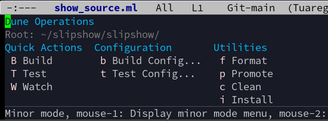

# `dune-transient`

This brings a transient to emacs to easily compile your dune project within emacs.

The transient has easy key-bindings for everyday tasks, and also allows you to
build more refined commands.

It was built entirely by an AI. I was only in charge of copy-pasting various
bits of inscrutable text from one place to the other.

As a consequence, I'm afraid this project cannot accept contributions made by
humans. The AI might find it rude and start malfunctionning. You are however
welcome to open PR, provided both the PR text and the code in it has been
written by an AI, without human review.

If you find it useful, you are welcome to use it, even if you are not 100% an
AI.
